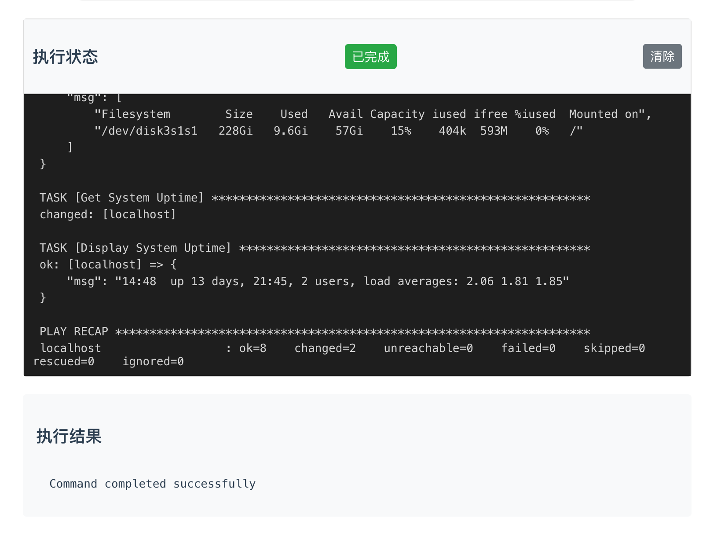
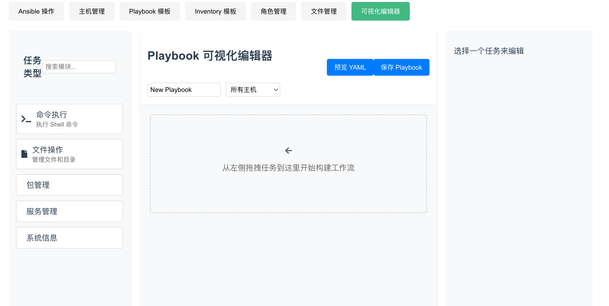

# Ansible Web 管理系统

这是一个基于 Web 的 Ansible 管理系统，提供了友好的图形界面来管理和执行 Ansible playbooks。

# 运行图

## 功能特点

### 1. Playbook 模板管理
- 创建和保存 playbook 模板
- 编辑现有模板
- 查看模板列表
- 支持变量配置
- 本地文件持久化存储

### 2. Inventory 模板管理
- 创建和保存 inventory 模板
- 编辑现有模板
- 查看模板列表
- 本地文件持久化存储

### 3. Ansible 操作
- 选择并执行 playbook
- 选择对应的 inventory
- 实时查看执行状态和日志
- 支持任务执行状态追踪
- 显示执行结果和错误信息

### 4. 主机管理
- 添加和管理主机信息
- 主机健康状态检查
- 主机分组管理
- 查看主机详细信息

### 5. 任务管理
- 查看任务执行历史
- 任务状态追踪
- 任务日志查看
- 支持任务进度显示

### 6. 通知系统
- 任务执行状态通知
- 错误提醒
- 通知消息管理

## 技术栈

### 前端
- Vue.js 2.x
- Vue Router
- Vuex
- SCSS
- ES6+

### 后端
- Go
- 原生 HTTP 服务器
- 文件系统存储

